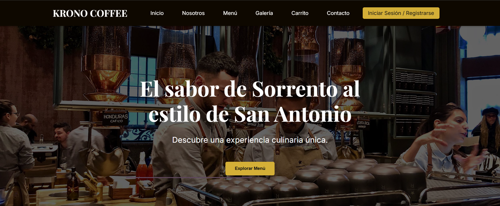

   
 <h1 align="center">☕ Krono Coffee</h1> <h1 align="center">https://krono-coffee-api.onrender.com</h1> 
 Aplicación web de gestión para cafeterías con <strong>FastAPI</strong>, <strong>postgreSQL</strong> y <strong>JavaScript</strong>. Diseñada para optimizar menús, pedidos, pagos y promociones a través de una interfaz moderna y eficiente. 

 

📸 Vista Previa

  

🚀 Tecnologías Utilizadas

       

📁 Estructura del Proyecto
bash
Copiar
Editar
krono_coffe_Python/
├── backend/
│   └── app/
│       ├── api/            # Rutas versionadas de la API
│       ├── core/           # Seguridad y configuración
│       ├── crud/           # Lógica de base de datos
│       ├── db/             # Modelo y conexión a la BD
│       └── app_main.py     # Punto de entrada del backend
├── frontend/
│   ├── index.html          # Interfaz principal
│   ├── style.css           # Estilos visuales
│   ├── script.js           # Lógica frontend
│   └── foto.jpg            # Imagen demostrativa
├── requirements.txt        # Dependencias de Python
🔑 Características Principales
✅ Autenticación JWT

📋 Gestión de Menús (crear, editar, listar)

🎁 Promociones y Ofertas vía API

🛒 Pedidos: gestión completa de órdenes

💳 Pagos vinculados a los pedidos

🔄 Sistema de Cambios (opcional)

⚙️ Instalación y Ejecución Local
1. Clonar el repositorio
bash
Copiar
Editar
git clone https://github.com/Reinosojp96/krono_coffe.git
cd krono_coffe_Python
2. Backend
bash
Copiar
Editar
cd backend
python -m venv .venv
source .venv/bin/activate  # En Windows: .venv\Scripts\activate
pip install -r requirements.txt
uvicorn app.app_main:app --reload
Accede a: http://localhost:8000

3. Frontend
Abre frontend/index.html directamente en el navegador
o usa la extensión Live Server de VS Code.

🔌 Conexión Backend ↔ Frontend
En frontend/script.js, configura la URL base de la API:

js
Copiar
Editar
const API_BASE_URL = 'http://localhost:8000/api/v1';
📎 Requisitos
Python 3.11+

Navegador moderno (Chrome, Firefox, Edge)

MySQL 8+ o equivalente compatible con SQLAlchemy

🛡 Seguridad
🔐 JWT para proteger rutas privadas

🌐 Middleware CORS

🧱 Separación de responsabilidades en el código

🤝 Autor
Julian Perdomo

    

⭐ ¡Gracias por visitar Krono Coffee! Si te gusta el proyecto, considera dejar una estrella ⭐

